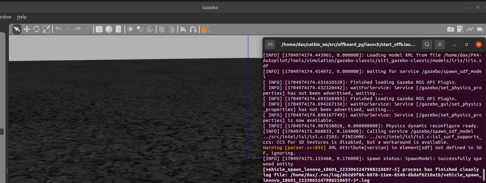

# PX4 autopilot

## Что-это
[PX4](https://docs.px4.io/main/en/ros/) — профессиональный автопилот . Разработанный разработчиками мирового класса из промышленности и научных кругов и поддерживаемый активным мировым сообществом, он используется на всех видах транспортных средств, от гоночных и грузовых дронов до наземных транспортных средств и подводных аппаратов.

## Оси
Принятые направления осей  


## Донастройка ROS и catkin  
В ходе настройки PX4 разобрался с нерабочим ранее [catkin build](https://stackoverflow.com/questions/41234957/catkin-command-not-found)  

## Установка MAVROS  
[MAVROS](https://docs.px4.io/main/en/ros/mavros_installation.html) - пакет ROS 1, который обеспечивает расширяемую связь MAVLink между компьютерами, на которых работает ROS 1, для любого автопилота, наземной станции или периферийного устройства с поддержкой MAVLink. MAVROS — это «официальный» поддерживаемый мост между ROS 1 и протоколом MAVLink.
Хотя MAVROS можно использовать для связи с любым автопилотом с поддержкой MAVLink, в этой документации объясняется, как настроить связь между автопилотом PX4 и сопутствующим компьютером с поддержкой ROS 1.  

1. Бинарная установка  
`sudo apt-get install ros-${ROS_DISTRO}-mavros ros-${ROS_DISTRO}-mavros-extras ros-${ROS_DISTRO}-mavros-msgs`  
  

2. Устанавливаю GeographicLib  
```sh
wget https://raw.githubusercontent.com/mavlink/mavros/master/mavros/scripts/install_geographiclib_datasets.sh
sudo bash ./install_geographiclib_datasets.sh
```  
  

3. Перехожу в catkin_ws  
```sh
cd ~/catkin_ws
catkin init
```  
  
`wstool init src`  
  

4. Инициализирую исходное пространство  
`wstool init ~/catkin_ws/src`  
  
И получю сообщение об ошибке, т.к. пространство уже инициализировано  

5. Устанавливаю MAVLink  
`rosinstall_generator --rosdistro kinetic mavlink | tee /tmp/mavros.rosinstall`
  

6. Устанавливаю MAVROS  
`rosinstall_generator --upstream mavros | tee -a /tmp/mavros.rosinstall`  
  

7. Создаю рабочее пространство и deps  
`wstool merge -t src /tmp/mavros.rosinstall`  
  

8. Обновляю  
`wstool update -t src -j8`  
Однако в отличие от стандартной команды, вместо j4 указываю j8, то есть 8 потоков вместо 4  
  
И я ранее уже установил  

9. Установка  
`rosdep install --from-paths src --ignore-src -y`  
  

10. Установка географических библиотек  
`sudo ./src/mavros/mavros/scripts/install_geographiclib_datasets.sh`
  

11. Сборка приложения  
`catkin build`  
однако сделал  
`catkin build mavros -j8`  
  

## Запуск  
```sh
cd ~/catkin_ws
roslaunch mavros px4.launch
```  
  
И т.к. у меня почему то нет такого порта _/dev/ttyACM0_, то логично получаю ошибку и вываливаюсь ...
Все...

## Установка [PX4](https://docs.px4.io/v1.13/en/dev_setup/dev_env_linux_ubuntu.html)  
1. В домашней директории создал папку PX4-Autopilot  
Скачал туда исходники PX4  
`git clone https://github.com/PX4/PX4-Autopilot.git --recursive`  

2. Запустил установщик ubuntu  
`bash ./PX4-Autopilot/Tools/setup/ubuntu.sh`  

3. Перезапустился  
`sudo reboot now`  

4. Запустил PX4  
`make px4_sitl jmavsim`  
и поиграл взлетом `commander takeoff` и посадкой `commander land`  
  

## Запуск скрипта  
1. В новом терминале перехожу в `cd ~/catkin_ws/src`  

2. Создаю новый пакет с именем offboard_py (в данном случае) с rospy зависимостью  
`catkin_create_pkg offboard_py rospy`  

3. Собираю новый пакет  
```sh
cd ~/catkin_ws
catkin build
source devel/setup.bash
```  

4. Подключаюсь к созданному пакету `roscd offboard_py`  

5. В пакете создаю папку для скриптов  
```sh
mkdir scripts
cd scripts
```  

6. В созданной папке для скриптов создаю скрипт  
```sh
touch offb_node.py
chmod +x offb_node.py
```  
с кодом  
```python
#!/usr/bin/env python

import rospy
from geometry_msgs.msg import PoseStamped
from mavros_msgs.msg import State
from mavros_msgs.srv import CommandBool, CommandBoolRequest, SetMode, SetModeRequest

current_state = State()

def state_cb(msg):
    global current_state
    current_state = msg


if __name__ == "__main__":
    rospy.init_node("offb_node_py")

    state_sub = rospy.Subscriber("mavros/state", State, callback = state_cb)

    local_pos_pub = rospy.Publisher("mavros/setpoint_position/local", PoseStamped, queue_size=10)

    rospy.wait_for_service("/mavros/cmd/arming")
    arming_client = rospy.ServiceProxy("mavros/cmd/arming", CommandBool)

    rospy.wait_for_service("/mavros/set_mode")
    set_mode_client = rospy.ServiceProxy("mavros/set_mode", SetMode)


    # Setpoint publishing MUST be faster than 2Hz
    rate = rospy.Rate(20)

    # Wait for Flight Controller connection
    while(not rospy.is_shutdown() and not current_state.connected):
        rate.sleep()

    pose = PoseStamped()

    pose.pose.position.x = 0
    pose.pose.position.y = 0
    pose.pose.position.z = 2

    # Send a few setpoints before starting
    for i in range(100):
        if(rospy.is_shutdown()):
            break

        local_pos_pub.publish(pose)
        rate.sleep()

    offb_set_mode = SetModeRequest()
    offb_set_mode.custom_mode = 'OFFBOARD'

    arm_cmd = CommandBoolRequest()
    arm_cmd.value = True

    last_req = rospy.Time.now()

    while(not rospy.is_shutdown()):
        if(current_state.mode != "OFFBOARD" and (rospy.Time.now() - last_req) > rospy.Duration(5.0)):
            if(set_mode_client.call(offb_set_mode).mode_sent == True):
                rospy.loginfo("OFFBOARD enabled")

            last_req = rospy.Time.now()
        else:
            if(not current_state.armed and (rospy.Time.now() - last_req) > rospy.Duration(5.0)):
                if(arming_client.call(arm_cmd).success == True):
                    rospy.loginfo("Vehicle armed")

                last_req = rospy.Time.now()

        local_pos_pub.publish(pose)

        rate.sleep()
```  

7. Создаю файл запуска  
```sh
roscd offboard_py
mkdir launch
cd launch
touch start_offb.launch
```  
с кодом  
```xml
<?xml version="1.0"?>
<launch>
	<!-- Include the MAVROS node with SITL and Gazebo -->
	<include file="$(find px4)/launch/mavros_posix_sitl.launch">
	</include>

	<!-- Our node to control the drone -->
	<node pkg="offboard_py" type="offb_node.py" name="offb_node_py" required="true" output="screen" />
</launch>
```  

8. В .bashrc добавляю  
```sh
source ~/PX4-Autopilot/Tools/simulation/gazebo-classic/setup_gazebo.bash ~/PX4-Autopilot ~/PX4-Autopilot/build/px4_sitl_default
export ROS_PACKAGE_PATH=$ROS_PACKAGE_PATH:~/PX4-Autopilot
export ROS_PACKAGE_PATH=$ROS_PACKAGE_PATH:~/PX4-Autopilot/Tools/simulation/gazebo-classic/sitl_gazebo-classic
export GAZEBO_PLUGIN_PATH=$GAZEBO_PLUGIN_PATH:/usr/lib/x86_64-linux-gnu/gazebo-9/plugins
```  
запускаю обновление терминала  
`source .bashrc`  

9. Запускаю скрипт  
`roslaunch offboard_py start_offb.launch`  
  
