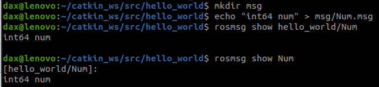
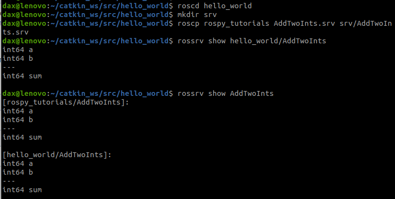

# Catkin - система сборки
Catkin включен по умолчанию при установке ROS. Catkin также можно установить из исходных кодов или готовых пакетов. Большинство пользователей захотят использовать готовые пакеты, но установить их из исходного кода также довольно просто.

# Создание workspace для catkin
`source /opt/ros/noetic/setup.bash`  
Создаем рабочую директорию для Catkin  
```bash
mkdir -p ~/catkin_ws/src
cd ~/catkin_ws/src
# указываем, что это рабочее пространство catkin
catkin_init_workspace
cd ~/catkin_ws
# собираем наши пакеты
catkin_make
```  

`source devel/setup.bash`  

```bash
echo $ROS_PACKAGE_PATH
/home/youruser/catkin_ws/src:/opt/ros/kinetic/share
```

# Поработаем с черепашкой, убедиться в работоспособности  
В одном окне запускаем ядро ROS  
```bash
cd ~/catkin_ws
roscore
```  
А в другом, узел отображения черепашки  
```bash
cd ~/catkin_ws
rosrun turtlesim turtlesim_node
```

1. Посмотрим список запущенных узлов  
`rosnode list`  
  
`/rosout` - стандарная нода, отвечающая за вывод сообщений на экран  

2. Смотрим список существующих топиков (тем)  
`rostopic list`  
`/rosout` и `/rosout_agg` - стандарные, публикуют сообщения журналов событий  

3. Установим систему визуального показа графов и запустим ее  
```bash
sudo apt-get install ros-noetic-rqt
sudo apt-get install ros-noetic-rqt-common-plugins
rosrun rqt_graph rqt_graph
```
  
_но здесь пока только 1 нода_

4. Запущу еще 1 ноду, для того, чтобы показать граф поинтересней  
`rosrun turtlesim turtle_teleop_key`  
  

5. Посмотрю, какие данные публикует teleop  
`rostopic echo /turtle1/cmd_vel`  
и вижу, что при нажатии клавиш, публикуются векторы линейных и угловых скоростей  
  
в графе вижу новый узел  
  

6. Посмотрю подробнее по ноде turtlesim
`rosnode info turtlesim`  
  
Вижу, что она подписана на топик */turtle1/cmd_vel*, а также тип сообщения *geometry_msgs/Twist*  
Также нода публикует данные в */rosout* тип сообщения *rosgraph_msgs/Log*, */turtle1/color_sensor* тип сообщения *turtlesim/Color* и */turtle1/pose* тип сообщения *turtlesim/Pose*

7. Аналогично можно посмотреть иинформацию и о *turtle1/cmd_vel*  
`rostopic info /turtle1/cmd_vel`  
  
В итоге вижу тип сообщения, издателя и подписчиков. В скобках указан адрес ноды и порт соединения  

8. Осталось разобраться с сообщениями  
Общение между узлами в ROS происходит путем сообщений. Что бы издатель и подписчик могли обмениваться сообщениями, они должны использовать один и тотже тип сообщения  
`rostopic type /turtle1/cmd_vel`  
*geometry_msgs/Twist*  
Более подробно о типе сообщения можно узнать командой  
`rosmsg show geometry_msgs/Twist`  
  

9. Зная это, можно вручную отпрвлять сообщения в топик  
`rostopic pub /turtle1/cmd_vel geometry_msgs/Twist`  
и пользуюсь хаком терминала с автодополнением, 2 раза нажимая TAB что бы терминал предложил мне шаблон  
  
и здесь уже заполняю как мне хочется. При этом можно передавать значения в виде вложенного словаря. К примеру *Ехать вперед 10 секунд со скоростью 0.5*  
`rostopic pub -r10 /turtle1/cmd_vel geometry_msgs/Twist '{linear: {x: 0.5, y: 0.0, z: 0.0}, angular: {x: 0.0, y: 0.0, z: 0.0}}'`

# Тренинг с созданием нового пакета hello_world  
1. Перейти в папку с проектом можно командой  
`roscd slam_ + TAB`  

2. Перехожу в папку src  
`cd ~/catkin_ws/src`  

3. Создаю новый пакет *hello_world*  
`catkin_create_pkg hello_world rospy`  
здесь добавил зависимость *rospy* для создания объектов ROS на языке Python  

4. Перехожу в src созданного пакета  
`cd hello_world/src/`  
и создаю там python файл  
`touch hw_publishing.py`  
и сразу же назначаю права на выполнение  
`chmod +x hw_publishing.py`  

5. Прописываю код ноды публикующей данные  
```python
#!/usr/bin/env python
#-*- coding: utf-8 -*-

import rospy
from std_msgs.msg import String

# создаю топик
pub = rospy.Publisher('hello', String, queue_size=10)
# инициализирую узел
rospy.init_node('hello_topic_publisher')
# вывожу сообщение на экран и записываюего в лог
rospy.loginfo('Hello from hello_world_publisher')
# устанавливаю частоту отправки сообщений 10Hz
r = rospy.Rate(10)

count = 0
# пока библиотека rospy не завершит свою работу
# публикую сообщение с заданной частотой
while not rospy.is_shutdown():
    pub.publish(f'hello world! {count}')
    count += 1
    r.sleep()
```

6. Перехожу в папку catkin_ws
`cd ~/catkin_ws`  
и запускаю сборку пакета  
`catkin_make`

7. Теперь надо перезапустить рабочее пространство!  
`source devel/setup.bash`  

8. Пробую запустить созданную ноду
В одном терминале запускаю ядро ROS  
`roscore`  
В другом запускаю ноду
`rosrun hello_world hw_publishing.py`  
однако ловлю ошибку 
```
...
ImportError: No module named yaml
```  
Как выяснилось, ошибка распространенная, и связана несколькими версиями Python. Решение проблемы нашел на StackOwerflow  
*https://stackoverflow.com/questions/75348692/ros-importerror-no-module-named-yaml*  
`ln -sf /usr/bin/python3 /usr/local/bin/python`  
И там же сказано, что *Вы можете поместить его в ~/.bashrc, чтобы избежать этого в будущем*
После данной команды моя нода запустилась  
Смотрю список топиков  
`rostopic list`  
и смотрю свой топик */hello*  
  
и вижу как и ожидалось, мое сообщение

9. Создание узла-подписчика  
```bash
cd ~/catkin_ws/src/hello_world/src
touch hw_subscriber.py
chmod +x hw_subscriber.py
```  
классический способ узнать тип сообщения
```bash
rostopic list
# смотрю нужный топик, в моем случае /hello
rostopic info /hello
# вижу тип сообщения std_msgs/String
```
Код узла - подписчика  
```python
#!/usr/bin/env python
#-*- coding: utf-8 -*-

import rospy
from std_msgs.msg import String


def hello_callback(message):
    print(message)

rospy.init_node('listener', anonimous=True)
rospy.Subscriber('hello', String, hello_callback)
rospy.spin()
```

10. Запуск узла-подписчика  
Перехожу `cd ~/catkin_ws/`  
Пересобираю пакет `catkin_make`  
Перегружаю рабочее пространство `source devel/setup.bash`  
Перехожу `cd ~/catkin_ws/src/hello_world/src/`  
Запускаю ноду `rosrun hello_world hw_subscriber.py`  
  
И вижу свое сообщение, на которое подписался  

---

# Учебный материал ROS
1. Устанавливаю учебные материалы
`sudo apt-get install ros-noetic-ros-tutorials`  

2. ROS дает возможность искать проекты  
`rospack find [package_name]`  
  

3. ROS дает возможность переходить между проектами  
`roscd <package-or-stack>[/subdir]`  

4. ROS дает возможность быстро перейти к логам  
`roscd log`  

5. ROS дает возможность просматривать проекты
`rosls <пакет-или-стек>[/subdir]`  

6. Сервисы — это еще один способ взаимодействия узлов друг с другом. 
Сервисы позволяют узлам отправлять **запрос** и получать **ответ**  
rosservice может легко подключиться к платформе клиент/сервис ROS с помощью сервисов. rosservice имеет множество команд, которые можно использовать в службах  
```bash
rosservice list         # print information about active services
rosservice call         # call the service with the provided args
rosservice type         # print service type
rosservice find         # find services by service type
rosservice uri          # print service ROSRPC uri
```  
7. Список сервисов  
`rosservice list`  
  

8. Тип сервиса  
`rosservice type [service]`  
команда для */clear* выглядит
`rosservice type /clear`  
*std_srvs/Empty*  
Эта служба *Empty*, это означает, что при вызове службы она не принимает аргументов (т. е. она не отправляет никаких данных при отправке **запроса** и не получает никаких данных при получении **ответа**)  

9. Вызову сервис  
`rosservice call [service] [args]`  
в моем случае  
`rosservice call /clear`  
Это ожидаемо почистило фон черепашки, убрав ранее имевшиеся следы  
  

10. Посмотрю сервис с параметрами  
`rosservice type /spawn | rossrv show`  
  
`rosservice call /spawn 2 2 0.2 ""`  
  
  

11. Список параметров  
`rosparam list`  
  

12. Получить и установить параметр  
```bash
rosparam set [param_name]
rosparam get [param_name]
```

`rosparam get /turtlesim/background_r`  
  
```bash
rosparam set /turtlesim/background_r 150
rosservice call /clear
```  
  
Можно получить весь список параметров  
`rosparam get /`  
  

13. Можно сделать дамп параметров и загрузку дампа  
```bash
rosparam dump [file_name] [namespace]
rosparam load [file_name] [namespace]
```
сниму дамп  
`rosparam dump params.yaml`  
  
изменю в дампе параметр *background_g: 255* и загружу его  
```bash
rosparam load params.yaml copy_turtle
rosparam get /copy_turtle/turtlesim/background_g
```

14. Использование rqt_console и rqt_logger_level  
**rqt_console** подключается к системе ведения журналов ROS для отображения выходных данных узлов  
**rqt_logger_level** позволяет нам изменять уровень детализации (DEBUG, WARN, INFO и ERROR) узлов во время их работы  

15. Использование roslaunch  
**roslaunch** запускает узлы, как определено в файле запуска  
`roslaunch [пакет] [имя файла.запуск]`  
  
В созданной папке создаю файл *turtlemimic.launch*  
```xml
<launch>

  <group ns="turtlesim1">
    <node pkg="turtlesim" name="sim" type="turtlesim_node"/>
  </group>

  <group ns="turtlesim2">
    <node pkg="turtlesim" name="sim" type="turtlesim_node"/>
  </group>

  <node pkg="turtlesim" name="mimic" type="mimic">
    <remap from="input" to="turtlesim1/turtle1"/>
    <remap from="output" to="turtlesim2/turtle1"/>
  </node>

</launch>
```  
Здесь запускаю launch file с тегом launch, чтобы файл был идентифицирован как launch file  
Начинаю две группы с namespace tag turtlesim1 и turtlesim2 с turtlesim node с именем sim. Это позволяет запускать два симулятора без конфликтов имен  
Запускаю узел мнемосхемы с input и output темами, переименованными в turtlesim1 и turtlesim2. Это переименование приведет к тому, что turtlesim2 будет имитировать turtlesim1  
Запускаю  
`roslaunch hello_world turtlemimic.launch`  
Добавлю движение 1-ой черепашке  
`rostopic pub /turtlesim1/turtle1/cmd_vel geometry_msgs/Twist -r 1 -- '[2.0, 0.0, 0.0]' '[0.0, 0.0, -1.8]'`  
Черепашки начали синхронное движение  
  
Посмотрю граф  
  

16. Использование rosed  
**rosed** входит в состав пакета *rosbash*. Он позволяет напрямую редактировать файл внутри пакета, используя имя пакета, вместо того, чтобы вводить полный путь к пакету  
`rosed [имя_пакета] [имя файла]`  

17. Создание нового типа msg  
```bash
roscd hello_world
mkdir msg
echo "int64 num" > msg/Num.msg
```  
можно конечно и более сложное сообщение создать  
```
string first_name
string last_name
uint8 age
uint32 score
```

В папке *hello_world* открою файл package.xml и раскоментирую 2 строчки  
```xml
<build_depend>message_generation</build_depend>
<exec_depend>message_runtime</exec_depend>
```  
«message_generation» - нужен во время сборки  
«message_runtime» - нужен во время выполнения  

В папке *hello_world* открою файл CMakeList.txt
* добавлю зависимость message_generation к вызову find_package  
* раскоментирую строку CATKIN_DEPENDS rospy в разделе catkin_package( ... )
* раскоменитирую блок кода и прописываю там свое сообщение  
    ```
    add_message_files(
        FILES
        Num.msg
    )
    ```  
* раскоментирую блок кода  
    ```
    generate_messages(
      DEPENDENCIES
      std_msgs  # Or other packages containing msgs
    )
    ```  

Теперь проверю, что ROS видит мое новое сообщение  
`rosmsg show [message type]`  
в моем случае  
`rosmsg show hello_world/Num`  
или без указания пакета, если не помню в каком пакете находтся такой тип  
`rosmsg show Num`  
  

18. Создание нового сервисного сообщения ***srv***  
Отличие сервисного сообщения от обычного, что оно содержит не только запрос *request*, но и ответ *response*, под ---  
```
int64 A
int64 B
---
int64 Sum
```  
Вместо того, чтобы вручную создавать новое определение srv, мы скопируем существующее из другого пакета. Для этого ***roscp*** — полезный инструмент командной строки для копирования файлов из одного пакета в другой  
`roscp [package_name] [file_to_copy_path] [copy_path]`  
в моем случае это  
`roscp rospy_tutorials AddTwoInts.srv srv/AddTwoInts.srv`  
После чего, в папке **srv** появился файл *AddTwoInts.srv*, скопированный из другого проекта (примеров)  
Однако есть еще один шаг. Нам нужно убедиться, что srv-файлы преобразованы в исходный код для C++, Python и других языков  

В папке *hello_world* открою файл package.xml и раскоментирую 2 строчки  
```xml
<build_depend>message_generation</build_depend>
<exec_depend>message_runtime</exec_depend>
```  
«message_generation» - нужен во время сборки  
«message_runtime» - нужен во время выполнения 

В папке *hello_world* открою файл CMakeList.txt
* добавлю зависимость message_generation к вызову find_package  
* раскоментирую строку CATKIN_DEPENDS rospy в разделе catkin_package( ... )
* раскоменитирую блок кода и прописываю там свое сообщение  
    ```
    add_service_files(
        FILES
        AddTwoInts.srv
    )
    ```  
* раскоментирую блок кода  
    ```
    generate_messages(
      DEPENDENCIES
      std_msgs  # Or other packages containing msgs
    )
    ```  

Теперь проверю, что ROS видит мое новое сервисное сообщение  
`rossrv show [message type]`  
в моем случае  
`rossrv show hello_world/AddTwoInts`  
или без указания пакета, если не помню в каком пакете находтся такой тип  
`rossrv show AddTwoInts`  
  
_Логично, что в моем случае нашлось 2 описания данного типа, т.к. я копировал его из пакета примеров_  

19. Общие шаги для msg и srv  
В CMakeLists.txt  
```
# generate_messages(
#   DEPENDENCIES
# #  std_msgs  # Or other packages containing msgs
# )
```
Надо раскоментировать и добавить все пакеты, от которых завишу и которые содержат файлы .msg, и используемые моими сообщениями (в данном случае std_msgs). Т.е.  
```
generate_messages(
  DEPENDENCIES
  std_msgs
)
```

Теперь, когда я создал несколько новых сообщений, нужно снова создать пакет  
```bash
# In your catkin workspace
roscd hello_world
cd ../..
catkin_make
cd -
```  
Альтернативой catkin_make является использование catkin build  
```bash
# In your catkin workspace
roscd hello_world
cd ../..
catkin build
cd -
```
_В моем случае **catkin build** не срабатывает. Сообщает, что ***catkin: команда не найдена***_  

Любой файл .msg в каталоге msg будет генерировать код для использования на всех поддерживаемых языках  
Файл заголовка сообщения C++ будет создан в ~/catkin_ws/devel/include/beginner_tutorials/  
Сценарий Python будет создан в ~/catkin_ws/devel/lib/python2.7/dist-packages/beginner_tutorials/msg  
Файл Lisp находится в папке ~/catkin_ws/devel/share/common-lisp/ros/beginner_tutorials/msg/  
Аналогично, любые файлы .srv в каталоге srv будут содержать код на поддерживаемых языках. Для C++ это создаст файлы заголовков в том же каталоге, что и файлы заголовков сообщений. Для Python и Lisp рядом с папками «msg» будет папка «srv».

К ***rosmsg*** есть помощь, т.к. слишком много паарметров запомнить  
`rosmsg -h`  
```
Commands:
  rosmsg show     Show message description
  rosmsg list     List all messages
  rosmsg md5      Display message md5sum
  rosmsg package  List messages in a package
  rosmsg packages List packages that contain messages
```  
Можно получить справку и по конкретной команде  
`rosmsg show -h`  
```
sage: rosmsg show [options] <message type>

Options:
  -h, --help  show this help message and exit
  -r, --raw   show raw message text, including comments
```

20. Написание издателя и подписчика на C++  
    1. Написание публикующей ноды  
    В папке **src** пакета *hello_world* создаю файл talker.cpp  
    ```C++
    /*
    ros/ros.h — это удобный компонент, включающий все заголовки,
    необходимые для использования наиболее распространенных
    общедоступных частей системы ROS
    */
    #include "ros/ros.h"
    /*
    Сообщение std_msgs/String , которое находится в пакете std_msgs
    Это заголовок, автоматически создаваемый из файла String.msg в этом пакете
    */
    #include "std_msgs/String.h"

    #include <sstream>

    /**
    В этом примере демонстрируется простая отправка сообщений через систему ROS
    */
    int main(int argc, char **argv)
    {
    /**
    * Функция ros::init() должна видеть argc и argv, чтобы она могла выполнить
    * любые аргументы ROS и переназначение имен, указанные в командной строке.
    * Для программного переназначения вы можете использовать другой init() который берет
    * переназначения напрямую, но для большинства программ передача argc и argv
    * самый простой способ сделать это.
    * Третий аргумент init() — это имя узла
    * Вы должны вызвать одну из версий ros::init() перед использованием любой другой
    * части системы ROS.
    */
    /*
    Инициализирую ROS. Это позволяет ROS переназначать имена через командную строку
    — на данный момент это не важно. Здесь же z указыва. имя узла.
    Имена узлов должны быть уникальными в работающей системе. 
    Используемое здесь имя должно быть базовым именем , т.е. в нем не может быть / 
    */
    ros::init(argc, argv, "talker");

    /**
    * NodeHandle — основная точка доступа к системе ROS.
    * Первый созданный NodeHandle полностью инициализирует этот узел, а последние
    * удаление NodeHandle приведет к закрытию узла.
    */
    /*
    Создаю дескриптор узла этого процесса.
    Первый созданный NodeHandle фактически выполнит инициализацию узла,
    а последний разрушенный — очистит все ресурсы, которые использовал узел
    */
    ros::NodeHandle n;

    /**
    * Функция advertise() позволяет сообщить ROS, что вы хотите
    * публиковать по указанному названию темы. Это вызывает главный узел ROS,
    * master node, который ведет реестр тех, кто публикует и кто
    * подписывается. После выполнения этого вызова advertise() master node
    * уведомит всех, кто попытается подписаться на это название темы,
    * и они, в свою очередь, согласуют одноранговое соединение с этим узлом.
    * advertise() возвращает объект Publisher, который позволяет вам
    * публиковать сообщения по этой теме с помощью вызова publish().  Однажды
    * все копии возвращенного объекта Publisher уничтожаются, тема
    * будет автоматически нерекламироваться.
    *
    * Второй параметр advertise() — это размер очереди сообщений
    * используется для публикации сообщений. Если сообщения публикуются быстрее
    * чем мы можем их отправить, здесь число указывает, сколько сообщений нужно отправить
    * в буфер, прежде чем их выбросить.
    */
    /*
    Сообщаю мастеру, что собираюсь публиковать сообщение типа std_msgs/String в теме "chatter"
    Это позволяет мастеру сообщать любым узлам, прослушивающим обмен информацией,
    что я собираюсь опубликовать данные по этой теме.
    Второй аргумент — это размер нашей очереди публикации. В этом случае, если мы
    публикуем слишком быстро, он будет буферизовать максимум 1000 сообщений,
    прежде чем начнет выбрасывать старые.
    NodeHandle::advertise() возвращает объект ros::Publisher,
    который служит двум целям:
    1) он содержит метод publish(), который позволяет публиковать сообщения в теме,
    в которой он был создан
    2) когда он выходит за рамки, он автоматически отключит оповещение.
    */
    ros::Publisher chatter_pub = n.advertise<std_msgs::String>("chatter", 1000);
    /*
    Объект ros::Rate позволяет вам указать частоту, на которой я хочу выдавать сообщения.
    Он будет отслеживать, сколько времени прошло с момента последнего вызова Rate::sleep(),
    и спать в течение нужного времени.
    В этом случае говорю, что работать на частоте 10 Гц.
    */
    ros::Rate loop_rate(10);

    /**
    * Подсчет количества отправленных нами сообщений. Это используется для создания
    * уникальной строки для каждого сообщения.
    */
    int count = 0;
    /*
    По умолчанию roscpp установит обработчик SIGINT, который обеспечивает обработку Ctrl-C,
    что приведет к тому, что ros::ok() вернет false, если это произойдет.
    ros::ok() вернет false, если:
        - получен SIGINT (Ctrl-C)
        - нас исключил из сети другой узел с таким же именем
        - ros::shutdown() был вызван другой частью приложения
        - все ros:: NodeHandles уничтожены
    Как только ros::ok() вернет false, все вызовы ROS завершится неудачей.
    */
    while (ros::ok())
    {
        /**
        * Это объект сообщения. Вы наполняете его данными, а затем публикуете.
        */
        std_msgs::String msg;

        std::stringstream ss;
        ss << "hello world " << count;
        msg.data = ss.str();
        /*
        ROS_INFO и его друзья — наша замена printf / cout
        */
        ROS_INFO("%s", msg.data.c_str());

        /**
        * Функция publish() позволяет отправлять сообщения. Параметр — объект сообщения.
        * Тип этого объекта должен совпадать с типом передаеющегося в качестве параметра
        * шаблона для вызова advertise<>(), как это было сделано выше в конструкторе
        * given as a template parameter to the advertise<>() call, as was done
        * in the constructor above.
        */
        /*
        Транслирую сообщение в ROS, используя адаптированный для сообщений класс, обычно
        создаваемый из файла msg. Возможны более сложные типы данных, но сейчас я собираюсь
        использовать стандартное сообщение String, которое имеет один элемент: «data»
        */
        chatter_pub.publish(msg);
        /*
        Вызов ros::spinOnce() здесь не обязателен для этой простой программы,
        поскольку я не получаю никаких обратных вызовов.
        Однако если я добавлю подписку в это приложение и здесь не будет ros::spinOnce(),
        мои обратные вызовы никогда не будут вызваны.
        Так что добавлю его для пущего удобства.
        */
        ros::spinOnce();
        /*
        Теперь я использую объект ros::Rate для сна на оставшееся время, чтобы 
        мог достичь скорости публикации 10 Гц.
        */
        loop_rate.sleep();
        ++count;
    }
    return 0;
    }
    ```

    2. Написание ноды подписчика  
    В папке **src** пакета *hello_world* создаю файл listener.cpp  
    ```C++
    #include "ros/ros.h"
    #include "std_msgs/String.h"

    /**
    * В этом руководстве демонстрируется простой прием сообщений через систему ROS.
    */
    void chatterCallback(const std_msgs::String::ConstPtr& msg)
    {
    ROS_INFO("I heard: [%s]", msg->data.c_str());
    }

    int main(int argc, char **argv)
    {
    /**
    * Функция ros::init() должна видеть argc и argv, чтобы она могла выполнить
    * любые аргументы ROS и переназначение имен, указанные в командной строке.
    * Для программного переназначения вы можете использовать другой init() который берет
    * переназначения напрямую, но для большинства программ передача argc и argv
    * самый простой способ сделать это.
    * Третий аргумент init() — это имя узла
    * Вы должны вызвать одну из версий ros::init() перед использованием любой другой
    * части системы ROS.
    */
    ros::init(argc, argv, "listener");

    /**
    * NodeHandle — основная точка доступа к системе ROS.
    * Первый созданный NodeHandle полностью инициализирует этот узел, а последние
    * удаление NodeHandle приведет к закрытию узла.
    */
    ros::NodeHandle n;

    /**
    * Вызов subscribe() позволяет сообщить ROS, что вы хотите получать сообщения
    * по заданной теме. Это вызывает master node ROS, который ведет реестр тех,
    * кто публикует и кто подписывается. Сообщения передаются в функцию обратного
    * вызова, здесь называется chatterCallback.  subscribe() возвращает объект
    * Subscriber, который необходимо держать до тех пор, пока вы не захотите отписаться.
    * Когда все копии подписчика объект выйдет за пределы области действия, подписка
    * на этот обратный вызов будет автоматически отписана от этой темы.
    * Второй параметр функции subscribe() — это размер буфера сообщений.
    * Если сообщения приходят быстрее, чем обрабатываются, это — количество сообщений,
    * которые будут помещены в буфер перед тем, как будут выбрасываться.
    */
    ros::Subscriber sub = n.subscribe("chatter", 1000, chatterCallback);

    /**
    * ros::spin() войдет в цикл, перекачивая обратные вызовы. В этой версии все
    * обратные вызовы будут вызываться изнутри этого потока (основного).  ros::spin()
    * завершится при нажатии Ctrl-C или при выключении узла мастером.
    */
    ros::spin();

    return 0;
    }
    ```  

    3. Для создания ноды  
    Текущий CMakeLists.txt должен выглядеть сейчас  
    ```
    cmake_minimum_required(VERSION 2.8.3)
    project(beginner_tutorials)

    ## Find catkin and any catkin packages
    find_package(catkin REQUIRED COMPONENTS roscpp rospy std_msgs genmsg)

    ## Declare ROS messages and services
    add_message_files(DIRECTORY msg FILES Num.msg)
    add_service_files(DIRECTORY srv FILES AddTwoInts.srv)

    ## Generate added messages and services
    generate_messages(DEPENDENCIES std_msgs)

    ## Declare a catkin package
    catkin_package()
    ```  
    И в конце необходимо добавить  
    ```
    add_executable(talker src/talker.cpp)
    target_link_libraries(talker ${catkin_LIBRARIES})
    add_dependencies(talker beginner_tutorials_generate_messages_cpp)

    add_executable(listener src/listener.cpp)
    target_link_libraries(listener ${catkin_LIBRARIES})
    add_dependencies(listener beginner_tutorials_generate_messages_cpp)
    ```  
    В итоге CMakeLists.txt будет выглядеть как  
    ```
    cmake_minimum_required(VERSION 2.8.3)
    project(beginner_tutorials)

    ## Find catkin and any catkin packages
    find_package(catkin REQUIRED COMPONENTS roscpp rospy std_msgs genmsg)

    ## Declare ROS messages and services
    add_message_files(FILES Num.msg)
    add_service_files(FILES AddTwoInts.srv)

    ## Generate added messages and services
    generate_messages(DEPENDENCIES std_msgs)

    ## Declare a catkin package
    catkin_package()

    ## Build talker and listener
    include_directories(include ${catkin_INCLUDE_DIRS})

    add_executable(talker src/talker.cpp)
    target_link_libraries(talker ${catkin_LIBRARIES})
    add_dependencies(talker beginner_tutorials_generate_messages_cpp)

    add_executable(listener src/listener.cpp)
    target_link_libraries(listener ${catkin_LIBRARIES})
    add_dependencies(listener beginner_tutorials_generate_messages_cpp)
    ```  

    Это создаст два исполняемых файла, talker и Listener, которые по умолчанию попадут в каталог пакетов вашего пространства разработки, расположенный по умолчанию в ~/catkin_ws/devel/lib/<имя пакета>.  
    Обратите внимание, что необходимо добавить зависимости для исполняемых целей к целям генерации сообщений  
    `add_dependencies(talker beginner_tutorials_generate_messages_cpp)`  
    Это гарантирует, что заголовки сообщений этого пакета будут созданы перед использованием. Если вы используете сообщения из других пакетов внутри своего рабочего пространства Catkin, вам также необходимо добавить зависимости к соответствующим целям генерации, поскольку Catkin собирает все проекты параллельно. Начиная с *Groovy*, вы можете использовать следующую переменную, чтобы зависеть от всех необходимых целей  
    `target_link_libraries(talker ${catkin_LIBRARIES})`  
    Можно вызывать исполняемые файлы напрямую или использовать для их вызова rosrun. Они не помещаются в «<prefix>/bin», поскольку это приведет к загрязнению PATH при установке пакета в систему. Если хотите, чтобы ваш исполняемый файл находился в PATH во время установки, вы можете настроить catkin/CMakeLists.txt

21. Написание издателя и подписчика на Python  
    1. Написание издателя  
    Перехожу в *hello_world* и создаю неходимые папки и файл  
    ```bash
    roscd hello_world
    mkdir scripts
    cd scripts
    touch talker.py
    chmod +x talker.py
    ```  
    
    Вписываю код  
    ```Python
    #!/usr/bin/env python
    # license removed for brevity

    import rospy
    from std_msgs.msg import String

    def talker():
        pub = rospy.Publisher('chatter', String, queue_size=10)
        rospy.init_node('talker', anonymous=True)
        rate = rospy.Rate(10) # 10hz
        while not rospy.is_shutdown():
            hello_str = "hello world %s" % rospy.get_time()
            rospy.loginfo(hello_str)
            pub.publish(hello_str)
            rate.sleep()

    if __name__ == '__main__':
        try:
            talker()
        except rospy.ROSInterruptException:
            pass
    ```

    Необходимо добавить следующее в свой CMakeLists.txt .Это гарантирует правильную установку сценария Python и использование правильного интерпретатора Python  
    ```
    catkin_install_python(PROGRAMS scripts/talker.py
        DESTINATION ${CATKIN_PACKAGE_BIN_DESTINATION}
    )
    ``` 

    `#!/usr/bin/env python` - Каждый узел Python ROS должен иметь это объявление вверху. Первая строка гарантирует, что ваш скрипт выполняется как скрипт Python  

    ```Python
    import rospy
    from std_msgs.msg import String
    ```  
    необходимо импортировать rospy, если пишем узел ROS. Импорт std_msgs.msg позволяет повторно использовать тип сообщения std_msgs/String (простой строковый контейнер) для публикации  

    ```Python
    pub = rospy.Publisher('chatter', String, queue_size=10)
    rospy.init_node('talker', anonymous=True)
    ```  
    Этот раздел кода определяет интерфейс говорящего с остальной частью ROS.  
    pub = rospy.Publisher("chatter", String, queue_size=10) объявляет, что узел публикует информацию в теме **chatter** , используя тип сообщения **String**. Строка здесь на самом деле является классом std_msgs.msg.String. Аргумент queue_size является новым в ROS Hydro и ограничивает количество сообщений в очереди, если какой-либо подписчик не получает их достаточно быстро. В старых дистрибутивах ROS этот аргумент просто опускают.
    Следующая строка, rospy.init_node(NAME, ...) очень важна, поскольку она сообщает rospy имя вашего узла — пока rospy не получит эту информацию, он не сможет начать связь с ROS Master. В этом случае узел получит имя talker.  
    ПРИМЕЧАНИЕ. Имя должно быть базовым, т. е. оно не может содержать косую черту «/».  
    anonymous = True гарантирует, что узел имеет уникальное имя.

    `rate = rospy.Rate(10) # 10hz` - Эта строка создает объект Rate. С помощью метода Sleep() он предлагает удобный способ зацикливания с желаемой скоростью. С его аргументом 10 мы должны ожидать, что цикл будет проходить 10 раз в секунду (пока наше время обработки не превышает 1/10 секунды!)  

    ```Python
    while not rospy.is_shutdown():
        hello_str = "hello world %s" % rospy.get_time()
        rospy.loginfo(hello_str)
        pub.publish(hello_str)
        rate.sleep()
    ```  
    Этот цикл представляет собой довольно стандартную конструкцию rospy.is_shutdown(). Вам нужно проверить is_shutdown(), чтобы проверить, должна ли ваша программа завершить работу (например, если есть Ctrl-C или иначе). В данном случае «работой» является вызов pub.publish(hello_str), который публикует строку в нашей теме chatter. Цикл вызывает функцию rate.sleep(), которая бездействует ровно столько, сколько необходимо для поддержания желаемой скорости в цикле.  
    _Вы также можете столкнуться с rospy.sleep(), который похож на time.sleep(), за исключением того, что он также работает с моделируемым временем_  
    Этот цикл также вызывает rospy.loginfo(str), который выполняет тройную задачу: сообщения выводятся на экран, записываются в файл журнала узла и записываются в rosout. rosout — удобный инструмент для отладки: вы можете получать сообщения, используя rqt_console, вместо того, чтобы искать окно консоли с выходными данными вашего узла.  

    ```Python
    msg = String()
    msg.data = str
    ```  
    std_msgs.msg.String — это очень простой тип сообщений, поэтому вам может быть интересно, как выглядит публикация более сложных типов. Общее эмпирическое правило заключается в том, что аргументы конструктора располагаются в том же порядке, что и в файле .msg. Вы также можете не передавать аргументы и инициализировать поля напрямую  
    ```Python
    msg = String()
    msg.data = str
    ```  
    или так  
    `String(data=str)`  

    ```Python
    try:
        talker()
    except rospy.ROSInterruptException:
        pass
    ```  
    В дополнение к стандартной проверке __main__ Python при этом перехватывается исключение rospy.ROSInterruptException, которое может быть вызвано методами rospy.sleep() и rospy.Rate.sleep() при нажатии Ctrl-C или при выключении узла по иным причинам. Причина, по которой возникает это исключение, заключается в том, что вы случайно не продолжаете выполнение кода после sleep()

    2. Написание подписчика  
    ```bash
    roscd hello_world/scripts/
    touch listener.py
    chmod +x listener.py
    ```  
    В созданном файле listener.py прописываем код  
    ```python
    #!/usr/bin/env python
    import rospy
    from std_msgs.msg import String

    def callback(data):
        rospy.loginfo(rospy.get_caller_id() + "I heard %s", data.data)
        
    def listener():

        # В ROS узлы имеют уникальные имена. Если два узла с одинаковыми
        # имя запускается, предыдущее удаляется.
        # anonymous=True означает, что rospy выберет уникальное имя
        # для нашего узла «прослушиватель», чтобы несколько прослушивателей могли
        # запускать одновременно.
        rospy.init_node('listener', anonymous=True)

        rospy.Subscriber("chatter", String, callback)

        # spin() просто не дает Python завершить работу,
        # пока этот узел не будет остановлен
        rospy.spin()

    if __name__ == '__main__':
        listener()
    ```  
    Затем редактирую CMakeLists.txt  
    ```
    catkin_install_python(PROGRAMS scripts/talker.py scripts/listener.py
        DESTINATION ${CATKIN_PACKAGE_BIN_DESTINATION}
    )
    ```  

    3. Сборка нодов  
    ```bash
    cd ~/catkin_ws
    catkin_make
    ```

Все работает  
  

22. Написание простого сервиса и клиента на Python  
    `roscd hello_world`  

    1. Написание сервисной ноды в **scripts/add_two_ints_server.py**  
    ```python
    #!/usr/bin/env python

    from __future__ import print_function

    from hello_world.srv import AddTwoInts,AddTwoIntsResponse
    import rospy

    def handle_add_two_ints(req):
        print("Returning [%s + %s = %s]"%(req.a, req.b, (req.a + req.b)))
        return AddTwoIntsResponse(req.a + req.b)

    def add_two_ints_server():
        rospy.init_node('add_two_ints_server')
        s = rospy.Service('add_two_ints', AddTwoInts, handle_add_two_ints)
        print("Ready to add two ints.")
        rospy.spin()

    if __name__ == "__main__":
        add_two_ints_server()
    ```  

    В CMakeLists.txt надо добавить  
    ```
    catkin_install_python(PROGRAMS scripts/add_two_ints_server.py
        DESTINATION ${CATKIN_PACKAGE_BIN_DESTINATION}
    )
    ```

    2. Написание клиентской ноды в **scripts/add_two_ints_client.py**  
    ```python
    #!/usr/bin/env python

    from __future__ import print_function

    import sys
    import rospy
    from hello_world.srv import *

    def add_two_ints_client(x, y):
        rospy.wait_for_service('add_two_ints')
        try:
            add_two_ints = rospy.ServiceProxy('add_two_ints', AddTwoInts)
            resp1 = add_two_ints(x, y)
            return resp1.sum
        except rospy.ServiceException as e:
            print("Service call failed: %s"%e)

    def usage():
        return "%s [x y]"%sys.argv[0]

    if __name__ == "__main__":
        if len(sys.argv) == 3:
            x = int(sys.argv[1])
            y = int(sys.argv[2])
        else:
            print(usage())
            sys.exit(1)
        print("Requesting %s+%s"%(x, y))
        print("%s + %s = %s"%(x, y, add_two_ints_client(x, y)))
    ```  

    И соответственно добавляем данный узел в CMakeLists.txt  

    3. Запускаю узел сервиса  
    [//]: # (https://get-help.robotigniteacademy.com/t/exercise-3-3-importerror-no-module-named-my-custom-srv-msg-pkg-srv/127/9)
    ```bash
    cd ~/catkin_ws
    source devel/setup.bash
    rosrun hello_world add_two_ints_server.py
    ```  
    _Но мне пришлось еще уалить все старые сборки_ ***hello_world*** _в devel и build_  
    Иначе получал ошибку  
      

    4. Запускаю узел клиента  
    ```bash
    cd ~/catkin_ws
    source devel/setup.bash
    rosrun hello_world add_two_ints_client.py 1 3
    ```  

    Результат  
      
    Все работает!!!  

23. Запись back data и их воспроизведение  
    1. Запись данных  
    В терминале 1 `roscore`  
    В терминале 2 `rosrun turtlesim turtlesim_node`  
    В терминале 3 `rosrun turtlesim turtle_teleop_key`  

    2. Запись всех опубликованных тем  
    `rostopic list -v`  
    Список опубликованных тем — единственные типы сообщений, которые потенциально могут быть записаны в файл журнала данных, поскольку записываются только опубликованные сообщения. Тема /turtle1/cmd_vel — это командное сообщение, опубликованное teleop_turtle, которое принимается в качестве входных данных для процесса Turtlesim. Сообщения /turtle1/color_sensor и /turtle1/pose — это выходные сообщения, опубликованные Turtlesim.      
    ```bash
    mkdir ~/bagfiles
    cd ~/bagfiles
    rosbag record -a
    ```      

    3. Для посмотреть в файл команда  
    `rosbag info <your bagfile>`  
      
    Запускал запись rosbag с флагом -a, и записывал все сообщения, опубликованные всеми узлами.  

    4. Воспроизведение  
    `rosbag play <your bagfile>`  
    В режиме по умолчанию rosbag play будет ждать определенный период (0,2 секунды) после объявления каждого сообщения, прежде чем фактически начнет публиковать содержимое файла Bag. Ожидание в течение некоторого времени позволяет любому подписчику сообщения быть предупрежденным о том, что сообщение было объявлено и что сообщения могут последовать за ним. Если rosbag play публикует сообщения сразу после рекламы, подписчики могут не получить первые несколько опубликованных сообщений. Период ожидания можно указать с помощью опции -d.  
    В конечном итоге тема /turtle1/cmd_vel будет опубликована, и черепаха должна начать двигаться в черепахе по шаблону, аналогичному тому, который вы выполнили в программе teleop. Продолжительность между запуском rosbag play и перемещением черепахи должна быть примерно равна времени между исходным выполнением записи rosbag и выдачей команд с клавиатуры в начальной части руководства. Вы можете сделать так, чтобы воспроизведение rosbag не начиналось с начала файла Bag, а вместо этого начиналось на некоторое время после начала, используя аргумент -s. Последняя опция, которая может представлять интерес, — это опция -r, которая позволяет вам изменить скорость публикации на указанный коэффициент.  

    `rosbag play -r 2 <your bagfile>`  
    Видим, как черепаха двигается по несколько иной траектории — это та траектория, которая была бы получена, если бы вы вводили команды с клавиатуры в два раза быстрее.

    5. Запись отдельных топиков  
    При работе сложной системы, такой как пакет программного обеспечения pr2, могут публиковаться сотни тем, причем некоторые темы, например потоки изображений с камер, потенциально могут публиковать огромные объемы данных. В такой системе часто непрактично записывать файлы журналов, состоящие из всех тем, на диск в одном файле-мешке. Команда rosbag Record поддерживает запись в файл Bag только определенных тем, что позволяет пользователям записывать только те темы, которые их интересуют  
    Если какие-либо узлы Turtlesim запущены, выйдите из них и перезапустите файл turtle_teleop_key  
    ```
    rosrun turtlesim turtlesim_node
    rosrun turtlesim turtle_teleop_key
    ```
    В каталоге Bagfiles выполните
    `rosbag record -O subset /turtle1/cmd_vel /turtle1/pose`  
    Аргумент -O указывает записи rosbag регистрироваться в файле с именем subset.bag, а аргументы темы заставляют запись rosbag подписываться только на эти две темы. Перемещайте черепаху в течение нескольких секунд, используя команды со стрелками на клавиатуре, а затем Ctrl-C запись rosbag

# Продвинутый уровень обучения ROS
1. Создание пакета ROS вручную  
Инструмент создания пакетов (catkin_create_pkg) в принципе не сложен. Т.к. пакет ROS — это всего лишь каталог и простой XML-файл.  
Для примера создам новый пакет foobar.
  
    1. Во первых необходимо добавить файл манифеста - package.xml. Этот файл позволяет таким инструментам как rospack, определять информацию о том, от чего зависит пакет.  
    ```xml
    <package format="2">
        <name>foobar</name>
        <version>1.2.4</version>
        <description>
            This package provides foo capability.
        </description>
        <maintainer email="foobar@foo.bar.willowgarage.com">PR-foobar</maintainer>
        <license>BSD</license>
        <buildtool_depend>catkin</buildtool_depend>
        <build_depend>roscpp</build_depend>
        <build_depend>std_msgs</build_depend>
        <exec_depend>roscpp</exec_depend>
        <exec_depend>std_msgs</exec_depend>
    </package>
    ```  
    Теперь, когда у пакета есть манифест, ROS может его найти. Попробую выполнить команду:  
      
    Все отлично находится.  
    Данный пакет зависит от **roscpp** и **std_msgs**, о чем указано в последних строках package.xml.  

    2. Теперь нужен файл - CMakeLists.txt. Данный файл catkin_make использует для большей гибкости при сборке на нескольких платформах.  
    ```
    cmake_minimum_required(VERSION 2.8.3)
    project(foobar)
    find_package(catkin REQUIRED roscpp std_msgs)
    catkin_package()
    ```  
    Это все, что нужно, чтобы начать сборку пакета в ROS с использованием catkin. Конечно, чтобы он действительно начал что-то создавать, нужно будет изучить еще пару макросов CMake. Но не думаю, что стоит сейчас это делать, т.к. это на данном этапе обучения не так важно.

2. Управление системными зависимостями  
    1. Системные зависимости  
    Пакетам ROS чаще всего требуются внешние библиотеки и инструменты, которые должны предоставляться операционной системой. Эти необходимые библиотеки и инструменты обычно называются _системными зависимостями_. В некоторых случаях эти системные зависимости не устанавливаются по умолчанию. ROS предоставляет простой инструмент **rosdep**, который используется для загрузки и установки системных зависимостей.  
    Пакеты ROS должны объявить, что им нужны эти системные зависимости в манифесте пакета. Для примера посмотрю на манифест пакета Turtlesim:  
    ```bash
    roscd turtlesim
    cat package.xml
    ```  
    ```
    <package>

    ...
    ...
        <build_depend>message_generation</build_depend>
        <build_depend>libqt4-dev</build_depend>
        <build_depend>qt4-qmake</build_depend>
        <build_depend>rosconsole</build_depend>
        <build_depend>roscpp</build_depend>
        <build_depend>roscpp_serialization</build_depend>
        <build_depend>roslib</build_depend>
        <build_depend>rostime</build_depend>
        <build_depend>std_msgs</build_depend>
        <build_depend>std_srvs</build_depend>
    </package>
    ```  
    
    2. rosdep  
    rosdep — это инструмент, который можно использовать для установки системных зависимостей, необходимых для пакетов ROS.  
    `rosdep install [package]`  
    Загружаю и устанавливаю системные зависимости для Turtlesim:  
    `rosdep install turtlesim`  
    В первый раз может проявиться ошибка, что rosdep еще не установлен. Надо будет установить его.  
       

3. Остальные разделы я прочитал, но на текущем уровне понимания ROS, описанное там мне кажется фантастическим. Врядли мне сейчас это нужно. Учиться буду постепенно.


