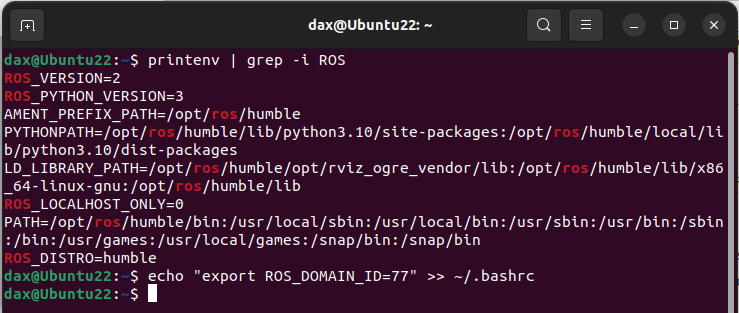

# Установка ROS2

На виртуальной машине, установил ROS2. Запустил пример Вещатель - Слушатель  
  
  
Пока все очень похоже было с ROS

# Обучение
## Новичок: CLI tools
### Настройка окружения
  

### Использую _turtlesim_, _ros2_ и _rqt_  
Turtlesim — это легкий симулятор для изучения ROS 2. Он иллюстрирует, что делает ROS 2, на самом базовом уровне, чтобы дать представление о том, что вы будете делать с настоящим роботом или его симуляцией позже.
Инструмент ros2 — это то, как пользователь управляет, анализирует и взаимодействует с системой ROS. Он поддерживает несколько команд, нацеленных на различные аспекты системы и ее работы. Его можно использовать для запуска узла, установки параметра, прослушивания темы и многого другого. Инструмент ros2 является частью базовой установки ROS 2.
rqt — это инструмент с графическим интерфейсом пользователя (GUI) для ROS 2. Все, что делается в rqt, можно сделать в командной строке, но rqt обеспечивает более удобный способ манипулирования элементами ROS 2.
В этом разделе рассматриваются основные концепции ROS 2, такие как узлы, темы и сервисы (все как в ROS). Все эти концепции будут подробно рассмотрены в последующих уроках.

1. Установка turtlesim  
```bash
sudo apt update
sudo apt install ros-humble-turtlesim
# Убеждаюсь, что пакет установлен
ros2 pkg executables turtlesim
# команда должна вернуть список исполняемых файлов Turtlesim:
# turtlesim draw_square
# turtlesim mimic
# turtlesim turtle_teleop_key
# turtlesim turtlesim_node
```  
  

2. Запуск turtlesim  
`ros2 run turtlesim turtlesim_node`  
Результат  
  

3. Управление turtlesim  
В новом терминале `ros2 run turtlesim turtle_teleop_key`   
Все как в ROS :)  

Можно просмотреть узлы и связанные с ними темы, услуги и действия, используя подкоманды _list_ соответствующих команд:
```bash
ros2 node list
ros2 topic list
ros2 service list
ros2 action list
```  

4. Установка rqt  
В новом терминале  
```bash
sudo apt update
sudo apt install ~nros-humble-rqt*
```  
Для запуска, команда `rqt`  

5. Использование rqt  
Выбираю в меню Plugins > Services > Service Caller  
_rqt_ может потребоваться некоторое время, чтобы найти все плагины. Если выбрав «Plugins», не видно «Службы» или какие-либо другие параметры, следует закрыть rqt и ввести команду в своем терминале `rqt --force-discover`  
  
    
    1. Сервис `/spawn`  
    Удобно вбиваем параметры и нажимаем call, появляется 2-я черепашка  

    2. Сервис `set_pen`  
    Аналогично меняем цвет и ширину "следа"  
      

6. Переназначение  
Нужен второй телеоптический узел для управления turtle2. Однако если запустить ту же команду, что и раньше, то она также управляет turtle1. Способ изменить это поведение — переназначить cmd_vel тему  
`ros2 run turtlesim turtle_teleop_key --ros-args --remap turtle1/cmd_vel:=turtle2/cmd_vel`  
  

7. В ходе дальнейшего просмотра примера ROS2 отличие увидел только в launch, который как говорилось ранее, можно создавать в виде python - файла  

## Новичок: CLI tools  
### colcon для сборки пакетов ROS2
1. Установка  
`sudo apt install python3-colcon-common-extensions`  

2. Создание рабочего пространства  
```bash
mkdir -p ~/ros2_ws/src
cd ~/ros2_ws
```  

3. Примеры  
`git clone https://github.com/ros2/examples src/examples -b humble`  

4. Создание рабочего пространства  
`colcon build --symlink-install`  

5. Запуск тестов  
`colcon test`  

6. Окружение  
Когда colcon успешно завершит сборку, выходные данные будут в installкаталоге. Прежде чем вы сможете использовать какие-либо установленные исполняемые файлы или библиотеки, вам необходимо добавить их в свой путь и пути к библиотекам. colcon сгенерирует файлы bash/bat в installкаталоге, чтобы помочь настроить среду. Эти файлы добавят все необходимые элементы в ваш путь и пути к библиотекам, а также предоставят любые команды bash или оболочки, экспортированные пакетами.  
`source install/setup.bash`  

7. Демо  
В 1 терминале  
`ros2 run examples_rclcpp_minimal_subscriber subscriber_member_function`  
В 2 терминале  
`ros2 run examples_rclcpp_minimal_publisher publisher_member_function`  
  

8. Настройка colcon_cd  
```bash
echo "source /usr/share/colcon_cd/function/colcon_cd.sh" >> ~/.bashrc
echo "export _colcon_cd_root=/opt/ros/humble/" >> ~/.bashrc
echo "source /usr/share/colcon_argcomplete/hook/colcon-argcomplete.bash" >> ~/.bashrc
```

### Создание рабочего пространства  
1. Клонирование образца  
```bash
cd ~/ros2_ws/src
git clone https://github.com/ros/ros_tutorials.git -b humble
```  

2. Разрешение зависимостей  
```bash
# cd if you're still in the ``src`` directory with the ``ros_tutorials`` clone
cd ..
rosdep install -i --from-path src --rosdistro humble -y
```
  

3. Создание рабочего пространства  
`colcon build`  

### Создание пакета  
Пакет — это организационная единица вашего кода ROS 2. Если вы хотите иметь возможность установить свой код или поделиться им с другими, вам понадобится организовать его в пакете. С помощью пакетов вы можете выпустить свою работу над ROS 2 и позволить другим легко ее создавать и использовать.  
`cd ~/ros2_ws/src`  
`ros2 pkg create --build-type ament_python --license Apache-2.0 --node-name my_node my_package --license Apache-2.0`  
`cd ~/ros2_ws`  
`colcon build`  
`colcon build --packages-select my_package`  
`source install/local_setup.bash`  
`ros2 run my_package my_node`  
  

### Простой издатель и подписчик на Python  
1. Создаю пакет  
```bash
cd ~/ros2_ws/src
ros2 pkg create --build-type ament_python --license Apache-2.0 py_pubsub
``` 

2. Загружаю код издателя  
```bash
cd ~/ros2_ws/src/py_pubsub/py_pubsub
wget https://raw.githubusercontent.com/ros2/examples/humble/rclpy/topics/minimal_publisher/examples_rclpy_minimal_publisher/publisher_member_function.py
```  

3. Зависимости в package.xml  
<description>Examples of minimal publisher/subscriber using rclpy</description>
<maintainer email="you@email.com">Your Name</maintainer>
<license>Apache License 2.0</license>

<exec_depend>rclpy</exec_depend>
<exec_depend>std_msgs</exec_depend>

4. В setup.py добавляю точку входа  
```
maintainer='YourName',
maintainer_email='you@email.com',
description='Examples of minimal publisher/subscriber using rclpy',
license='Apache License 2.0',

entry_points={
    'console_scripts': [
        'talker = py_pubsub.publisher_member_function:main',
    ],
},
```  

5. Проверяю setup.cfg  
```
[develop]
script_dir=$base/lib/py_pubsub
[install]
install_scripts=$base/lib/py_pubsub
```  

6. Написание узла подписчика  
```bash
cd ~/ros2_ws/src/py_pubsub/py_pubsub
wget https://raw.githubusercontent.com/ros2/examples/humble/rclpy/topics/minimal_subscriber/examples_rclpy_minimal_subscriber/subscriber_member_function.py
```  

7. В setup.py добавляю точку входа  
```
entry_points={
    'console_scripts': [
        'talker = py_pubsub.publisher_member_function:main',
        'listener = py_pubsub.subscriber_member_function:main',
    ],
},
```  

8. Создание и запуск  
`rosdep install -i --from-path src --rosdistro humble -y`  
в ros2_ws  
`colcon build --packages-select py_pubsub`  
В новом терминале  
```bash
source install/setup.bash
ros2 run py_pubsub talker
```  
  

---
В целом все не сильно отличается от ROS
